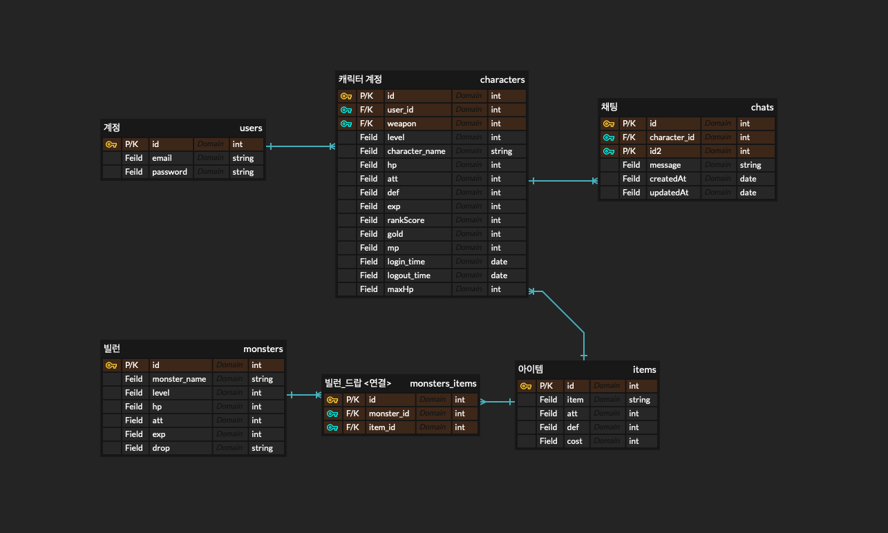
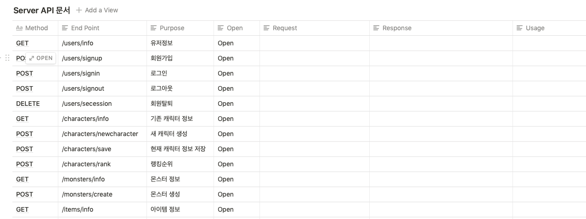

## Zeminia Projeckt Back_End

이 App 은 Zeminia 게임의 백엔드 부분을 다룹니다.

## 개발자

권현우, 김규동

## 사용 스택

express, sequelize, AWS EC2

## Modules

1. express
2. express-session
3. express-mysql-session
4. body-parser
5. bcrypt
6. cors
7. nodemon
8. sequelize
9. sequelize-cli
10. mysql2
11. dotenv
12. helmet
13. hpp
14. morgan
15. multer
16. pm2
17. socket.io
18. winston
19. winston-daily-rotate-file

## MVC Design Pattern

## Database Schema

## API Docs

## Clinet 시연영상

다음 링크를 참고해주세요.
https://youtu.be/il3JQBGZCWU
